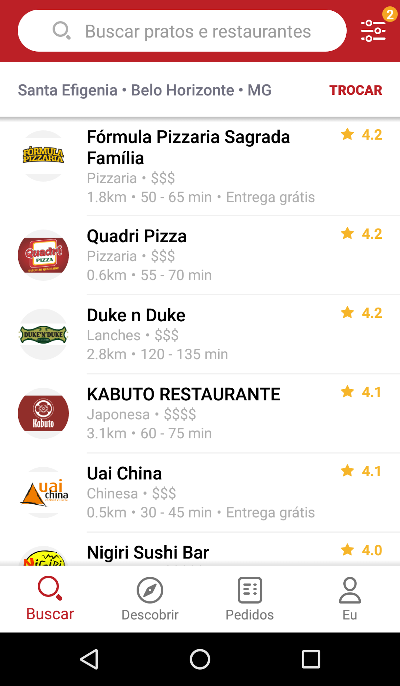
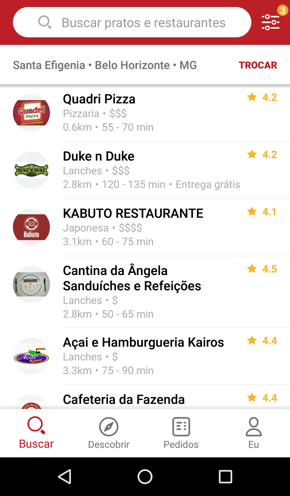
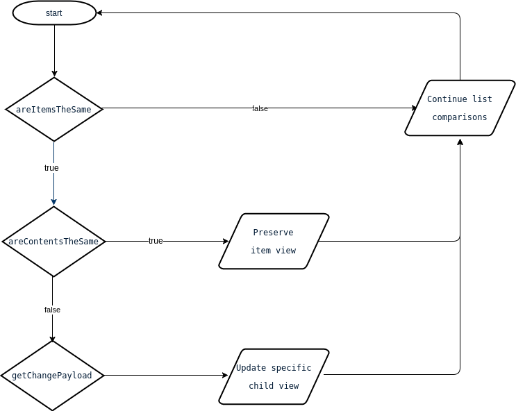

# DiffUtil

---

*Os slides estão disponíveis aqui: [https://speakerdeck.com/jeanpimentel/diffutil](https://speakerdeck.com/jeanpimentel/diffutil)*

---

Algumas listas são constantemente atualizadas por diversos motivos: geolocalização, ordenação, uso de filtros, dados em tempo real etc.

| Antes                | Depois de adicionar um filtro |
|----------------------|-------------------------------|
|  |           |


Quando isso ocorre, passamos a nova lista para o Adapter e geralmente chamamos `notifyDataSetChanged()`.

* Essa operação é custosa, pois `notifyDataSetChanged()` invalidará todos os dados e todas as views "visíveis" serão destruídas e recriadas.

Há quem também recrie o Adapter nesses casos, mas isso é ainda mais custoso.

## DiffUtil

Classe auxiliar contida na `support-v7` que calcula a diferença entre duas listas e retorna uma lista de operações a serem feitas para essa conversão.

É necessário estender `DiffUtil.Callback` e implementar os métodos:

```java
int getOldListSize();
int getNewListSize();
boolean areItemsTheSame(int oldItemPosition, int newItemPosition);
boolean areContentsTheSame(int oldItemPosition, int newItemPosition);
Object getChangePayload(int oldItemPosition, int newItemPosition);
```

Exemplo:

```java
public class PlacesDiffCallback extends DiffUtil.Callback {

	private List<Place> oldItems;
	private List<Place> newItems;

	public PlacesDiffCallback(List<Place> oldItems, List<Place> newItems) {
		this.oldItems = oldItems;
		this.newItems = newItems;
	}

	@Override
	public int getOldListSize() {
		return oldItems.size();
	}

	@Override
	public int getNewListSize() {
		return newItems.size();
	}

	@Override
	public boolean areItemsTheSame(int oldItemPosition, int newItemPosition) {
		return newItems.get(newItemPosition).getId() == oldItems.get(oldItemPosition).getId();
	}

	@Override
	public boolean areContentsTheSame(int oldItemPosition, int newItemPosition) {
		return newItems.get(newItemPosition).equals(oldItems.get(oldItemPosition));
	}

	@Nullable
	@Override
	public Object getChangePayload(int oldItemPosition, int newItemPosition) {

		Place newPlace = newItems.get(newItemPosition);
		Place oldPlace = oldItems.get(oldItemPosition);

		Bundle diffBundle = new Bundle();

		if (newPlace.getDistance() != oldPlace.getDistance()) {
			diffBundle.putInt(Place.KEY_DISTANCE, newPlace.getDistance());
		}

		if (!newPlace.getPrice().equals(oldPlace.getPrice())) {
			diffBundle.putString(Place.KEY_PRICE, newPlace.getPrice());
		}

		if (!newPlace.getWaitingTime().equals(oldPlace.getWaitingTime())) {
			diffBundle.putString(Place.KEY_WAITING_TIME, newPlace.getWaitingTime());
		}

		if (newPlace.hasFreeDelivery() != oldPlace.hasFreeDelivery()) {
			diffBundle.putBoolean(Place.KEY_FREE_DELIVERY, newPlace.hasFreeDelivery());
		}

	   return diffBundle.size() == 0 ? null : diffBundle;
	}
}
```

Fluxograma:




## DiffUtil + DiffUtil.Callback

No nosso exemplo, depois de adicionarmos um filtro na nossa tela, chamamos nossa API e como resposta teremos uma nova lista:

```java
public void onListChanged(List<Place> newPlaces) {

    PlacesDiffCallback callback = new PlacesDiffCallback(places, newPlaces);
    
    DiffUtil.DiffResult diffResult = DiffUtil.calculateDiff(callback);
    diffResult.dispatchUpdatesTo(adapter);
}
```

`DiffResult` é um objeto que contem todas as alterações que deverão ser aplicadas no seu adapter. E isso é feito com a chamada `dispatchUpdatesTo(adapter)`.

### Considerações

- Não bloqueie sua UI. Obtenha o DiffResult em background e aplique na mainThread.

- O DiffUtil utiliza o algoritmo de Eugene Myers, de complexidade **O(n)**. 

- No entanto, se houver movimentação de itens, a complexidade é aumentada em **O(n^2)**, onde n = número de elementos adicionados e removidos.

- Se suas listas são ordenadas sempre pelo mesmo critério, desabilite a detecção de movimento.

---

Source: [https://medium.com/@iammert/using-diffutil-in-android-recyclerview-bdca8e4fbb00#.pot2fgqlq](https://medium.com/@iammert/using-diffutil-in-android-recyclerview-bdca8e4fbb00#.pot2fgqlq)

