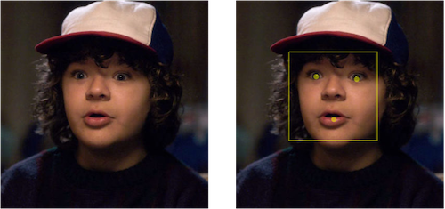
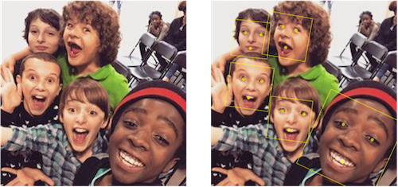

# CIDetector

*Core Image*, framework de manipulação de imagens

Detecta:

- Faces (5.0, *)
- Retângulos (8.0, *)
- QRCode (8.0, *)
- Textos (9.0, *)


## CIDetectorTypeFace
@available(iOS 5.0, *)

_CIDetectorSmile, CIDetectorEyeBlink_
_@available(iOS 7.0, *)_

```swift
let image = UIImage(named:"example")!

let ciImage = CIImage(CGImage: image.CIImage!)

let detector = CIDetector(ofType: CIDetectorTypeFace, context: nil, options: nil)

for f in detector.featuresInImage(ciImage) {
guard let face = f as? CIFaceFeature else { continue }

       print(face.bounds)
		// ...
}
```



