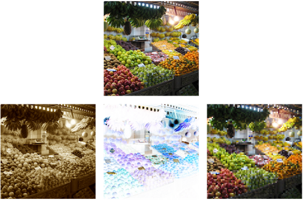
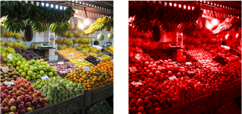

# CIFilter

@available(iOS 5.0, *)

Categorias:
- Blur, ColorAdjustment, ColorEffect, CompositeOperation, DistortionEffect, Generator, GeometryAdjustment, Gradient, HalftoneEffect, Reduction, Sharpen, Stylize, TileEffect, Transition

## CIFilter - CISepiaTone, CIColorInvert...

```swift
// each filter has different parameters
let params = ["inputImage": image]

// other names: CIColorInvert, CIPixellate, ...
let filter = CIFilter(name: "CISepiaTone", withInputParameters: params)

let output = UIImage(CIImage: filter!.outputImage!)
```



## CIFilter - CIColorMonochrome

```swift
let color = CIColor(red: 1.0, green: 0.0, blue: 0.0)

let params = [
"inputImage": image, 
"inputColor": color
]

let filter = CIFilter(name: "CIColorMonochrome", withInputParameters: params)

let output = UIImage(CIImage: filter!.outputImage!)
```



