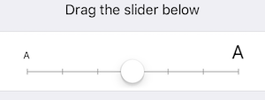
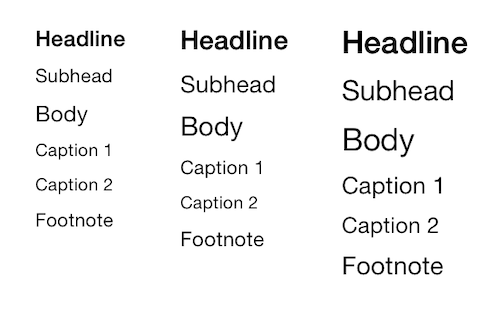

# Dynamic Type

@available(iOS 7.0, *)


Acessibilidade

Usuário controla o tamanho das fonts no dispositivo
  - ExtraSmall
  - Small
  - Medium
  - Large
  - ExtraLarge
  - ExtraExtraLarge
  - ExtraExtraExtraLarge





Atualmente existem 10 estilos

- Title1 *(9.0+)*

- Title2 *(9.0+)*

- Title3 *(9.0+)*

- Headline

- Subheadline

- Body

- Footnote

- Caption1

- Caption2

- Callout *(9.0+)*

  




```swift
label.font = UIFont.preferredFontForTextStyle(UIFontTextStyleBody)

//

NSNotificationCenter.defaultCenter().addObserver(
	self,
	selector: #selector(callMe),
	name: UIContentSizeCategoryDidChangeNotification,
	object: nil
)
```